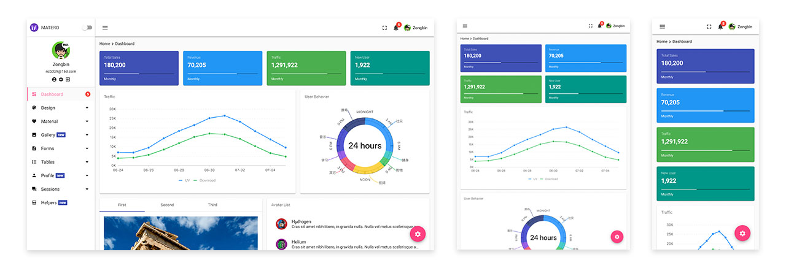

# Getting Started

Ng-Matero is a project based in Angular Material Components, so you need to know the basics of TypeScript and Sass

## Installation

The easiest way to initialize the project is to use the CLI, you can customize admin template and theme. See [Project Init](schematics/project-init.md) for details.

```bash
$ ng new <project-name>
$ cd <project-name>
$ ng add ng-matero
```
Except using CLI, you can also clone the Starter repo, but Starter has just side nav layout.

```bash
$ git clone --depth=1 git@github.com:ng-matero/starter.git <project-name>
$ cd <project-name>
$ npm install
```

## Development

It is recommended to run the program using hmr, do not use `npm start` or `ng serve`.

```bash
$ npm run hmr
```

Clone the whole repo.

```bash
$ git clone git@github.com:ng-matero/ng-matero.git
$ cd ng-matero
$ npm install
$ npm run hmr
```

Navigate to `http://localhost:4200/`. The app will automatically reload if you change any of the source files.



## Project Directory

```plain
├── src
│   ├── app
│   │   ├── core
│   │   │   ├── interceptors
│   │   │   │   └── default.interceptor.ts      
│   │   │   ├── services
│   │   │   │   ├── settings.service.ts
│   │   │   │   ├── menu.service.ts
│   │   │   │   └── startup.service.ts
│   │   │   │── core.module.ts
│   │   │   │── **
│   │   │   └── settings.ts
│   │   ├── routes
│   │   │   ├── ** 
│   │   │   ├── routes-routing.module.ts
│   │   │   └── routes.module.ts
│   │   ├── shared
│   │   │   |—— **
│   │   │   └── shared.module.ts
│   │   ├── theme
│   │   │   ├── admin-layout
│   │   │   ├── auth-layout
│   │   |   └── theme.module.ts
│   │   ├── app.component.ts
│   │   └── app.module.ts
│   │   └── material.module.ts
│   ├── assets
│   ├── environments
│   ├── styles
│   │   ├── functions
│   │   ├── helpers
│   │   ├── mixins
│   │   ├── plugins
│   │   ├── theme
│   │   ├── widgets
│   │   ├── **
│   │   └── app.scss
└── └── style.scss
```

The directory structure follows the Angular style guide, and is also for convenience of the CLI to add business module. There may be some small adjustments in the future.

## Project Running

The project runs `startup.service` by default. Some key information (such as menu data, user data, etc.) before the project starts can be written in the `startup.service`.
