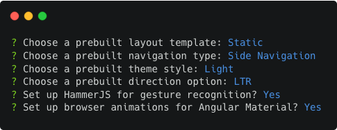

# Install the Project

Using the `ng add` command, you can quickly create a project directory and configure the theme style with the CLI option.

<span>1.<span> Create an Angular project. It is recommended using the latest version of CLI (8.x), lower versions may have compatibility issues.

```bash
$ ng new <project-name>
$ cd <project-name>
```

> It is best to choose Scss (Sass) as CSS preprocessor, you cannot use the theming variables provided by Angular Material and ng-matero if you use other preprocessor。

<span>2.<span> Add ng-matero

```bash
$ ng add ng-matero
```

## Initialization options

There is a prebuild option when adding projects, which allows you to customize themes more quickly.



- Choose a prebuilt layout template (`static`/`dynamic`)

  `static` means static template. You cannot change the layout style by `options` after the project starts.

  `dynamic` retains all layout parameters and can be changed dynamically by `options` after the project is started, as in the example.

- Choose a prebuilt navigation type (`side`/`top`)

- Choose a prebuilt theme style (`light`/`dark`)

- Choose a prebuilt direction option (`ltr`/`rtl`)

- Set up HammerJS for gesture recognition (`Yes`/`No`)

- Set up browser animations for Angular Material (`Yes`/`No`)